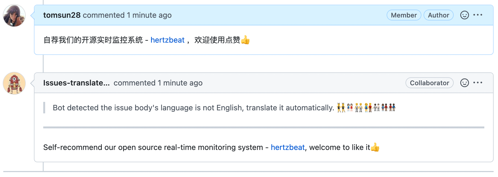

# Issues Translate Action  

The action for translating Non-English issues content to English.   

[中文文档](README_CN.md)   

## Usage  

> Use the default bot account @Issues-translate-bot  

#### Create a workflow from this action   

> Create file issue-translator.yml in .github/workflows/     

````
name: 'issue-translator'
on: 
  issue_comment: 
    types: [created]
  issues: 
    types: [opened]

jobs:
  build:
    runs-on: ubuntu-latest
    steps:
      - uses: tomsun28/issues-translate-action@v2.6
        with:
          IS_MODIFY_TITLE: false
          # not require, default false, . Decide whether to modify the issue title
          # if true, the robot account @Issues-translate-bot must have modification permissions, invite @Issues-translate-bot to your project or use your custom bot.
          CUSTOM_BOT_NOTE: Bot detected the issue body's language is not English, translate it automatically. 👯👭🏻🧑‍🤝‍🧑👫🧑🏿‍🤝‍🧑🏻👩🏾‍🤝‍👨🏿👬🏿
          # not require. Customize the translation robot prefix message.
````


## Advanced Custom   

> Use your own bot by add BOT_GITHUB_TOKEN   
> 

1. Create a new github account as your bot  

2. Use the account to generate a new token as BOT_GITHUB_TOKEN  

3. Add the Secrets BOT_GITHUB_TOKEN = ${token} in your project  

4. Create a workflow from this action(Create file issue-translator.yml in .github/workflows/)    

````
name: 'issue-translator'
on: 
  issue_comment: 
    types: [created]
  issues: 
    types: [opened]

jobs:
  build:
    runs-on: ubuntu-latest
    steps:
      - uses: tomsun28/issues-translate-action@v2.6
        with:
          BOT_GITHUB_TOKEN: ${{ secrets.BOT_GITHUB_TOKEN }} 
          # Required, input your bot github token
          BOT_LOGIN_NAME: Issues-translate-bot    
          # Not required, suggest not input, action will get name from BOT_GITHUB_TOKEN
          # If input, BOT name must match github token
````


## Other   

1. invite @Issues-translate-bot to your project.    
Project -> Settings -> Manage access -> Invite a collaborator   
Post an issue in [issues-translate-action](https://github.com/tomsun28/issues-translate-action) to let us konw, the @Issues-translate-bot will join soon.    

## DEMO  

   

## Who Use the Action?  

1. [hertzbeat](https://github.com/dromara/hertzbeat) **Create By Us** - A real-time monitoring system with custom-monitor and agentless.
2. [sureness](https://github.com/dromara/sureness) **Create By Us** - A simple and efficient security framework that focus on protection of API.
3. [go-zero](https://github.com/zeromicro/go-zero) - A cloud-native Go microservices framework with cli tool for productivity.
4. [dashy](https://github.com/Lissy93/dashy) - A self-hostable personal dashboard built for you.
5. [wails](https://github.com/wailsapp/wails) - Create beautiful applications using Go
6. [seata-go](https://github.com/seata/seata-go) - Go Implementation For Seata
7. [rainbond](https://github.com/goodrain/rainbond) - Cloud native multi cloud application management platform
8. [adempiere](https://github.com/adempiere/adempiere) - ADempiere Business Suite done the Bazaar way in an open and unabated fashion.
9. [carbon](https://github.com/golang-module/carbon) - A simple, semantic and developer-friendly golang package for datetime
10. [tabby](https://github.com/Eugeny/tabby) - A terminal for a more modern age
11. [gorse](https://github.com/gorse-io/gorse) - An open source recommender system service written in Go

**Have Fun!**  


## Contributors ✨ 

<!-- ALL-CONTRIBUTORS-LIST:START - Do not remove or modify this section -->
<!-- prettier-ignore-start -->
<!-- markdownlint-disable -->
<table>
  <tbody>
    <tr>
      <td align="center"><a href="http://hertzbeat.com"><br /><sub><b>tomsun28</b></sub></a><br /><a href="https://github.com/usthe/issues-translate-action/commits?author=tomsun28" title="Code">💻</a> <a href="#content-tomsun28" title="Content">🖋</a></td>
      <td align="center"><a href="https://allcontributors.org"><br /><sub><b>All Contributors</b></sub></a><br /><a href="https://github.com/usthe/issues-translate-action/commits?author=all-contributors" title="Documentation">📖</a></td>
      <td align="center"><a href="https://dev.to/chenquan"><br /><sub><b>chen quan</b></sub></a><br /><a href="https://github.com/usthe/issues-translate-action/commits?author=chenquan" title="Code">💻</a></td>
    </tr>
  </tbody>
</table>

<!-- markdownlint-restore -->
<!-- prettier-ignore-end -->

<!-- ALL-CONTRIBUTORS-LIST:END -->
